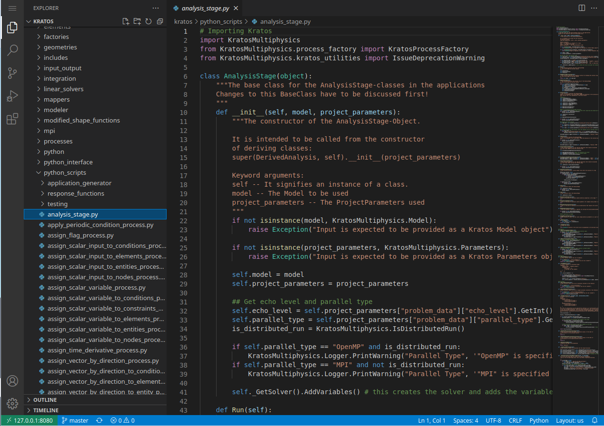

# KratosDockerForDebugging

[![License][license-image]][license]  

[license-image]: https://img.shields.io/badge/license-MIT-blue.svg?style=flat
[license]: https://github.com/loumalouomega/KratosDockerForDebugging/blob/main/LICENSE

This is a docker file for generate a debugging VM.

Uses VS Code server so the debugging is easier

# How to use

## Compile

### Compile without VS Code server

~~~sh
docker build -f ./docker/Dockerfile -t KratosTest .

~~~

### Compile with VS Code server

~~~sh
docker build -f ./docker/Dockerfile_with_VSCODE -t KratosTestVSCode .
~~~

## Download current image from

### Without VS Code server

~~~sh
docker pull loumalouomega/kratos4debug:KratosTest
~~~

### With VS Code server

~~~sh
docker pull loumalouomega/kratos4debug:KratosTestVSCode
~~~

## Run

### Without VS Code server

~~~sh
docker run -it loumalouomega/kratos4debug:KratosTest
~~~

### With VS Code server

~~~sh
docker run -p 8080:8080 --network="host" loumalouomega/kratos4debug:KratosTestVSCode
~~~

## VS Code Server

Once you have started the docker image with VS Code server you can acess to the instance going to [localhost:8080](http://127.0.0.1:8080).

